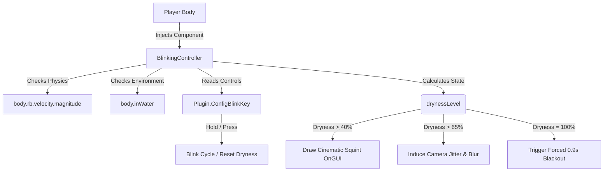

# Manual Blinking & Focus Mod 👁️

An immersive, high-stakes physiological simulation mod for **Casualties Unknown**. This mod replaces passive visual clarity with a manual ocular regulation loop. Players must periodically blink to moisten their eyes, manage ocular dryness under harsh environmental conditions, and survive high-tension involuntary squinting or forced blinking during critical gameplay moments.

---

## ─── CORE MECHANICS ───────────────────────────────────────

### 1. The Dryness Loop (`drynessLevel`)
*   Your eyes dry out naturally over time.
*   **Base Dryness Rate**: Takes roughly `0.8 seconds` (with default `BaseDrySpeed = 1.25f`) to go from fully hydrated to dangerously dry. This ensures players must blink regularly and keep watch of ocular state.
*   **Environmental & Physical Scaling**:
    *   **Wind / Movement Velocity**: Movement speed (retrieved via `body.rb.velocity`) pushes air into your eyes, increasing dry-out speed by up to **2.2x** at terminal velocities.
    *   **Submersion (`inWater`)**: Opening eyes underwater or getting splashed increases irritation and salt/chlorine drying by **3.0x**.
    *   **Severe Injury / Pain**: Ocular fatigue increases under intense pain or high heart rate.

### 2. Manual Blinking & Eye Closure
*   **Manual Blink Key**: Pressing a single key (default: `CapsLock`) triggers a quick blink cycle, resetting `drynessLevel` back to `0.0f`.
*   **Ocular Focus (Holding closed)**: Keeping the blink key held down closes your eyelids permanently. 
    *   **Smooth Cinematic Fading**: Instead of instantly snapping dark, the eyelids fade to dark **really fast** (~0.06 seconds) when closed, and fade back to normal **slightly slower** (~0.25 seconds) when released, providing a smooth visual transition.
    *   **Benefits**: Rapidly relieves dryness, aids in recovering from temporary blindness (e.g., flashes/glare), and dampens intense camera shakes.
    *   **Consequence**: Complete blackout—you are blind to your surroundings while your eyes are closed.

### 3. The Threat: Dry Eye Penalties
As `drynessLevel` passes certain thresholds, your ocular control degrades progressively:
*   **Stage 1: Cinematic Squint (> 40% Dryness)**:
    *   Two dark cinematic eyelid bands close in from the top and bottom of the screen, physically narrowing your vertical field of view to simulate squinting through dry irritation.
*   **Stage 2: Stinging Red Vignette & Violent Spasms (> 50% Dryness)**:
    *   A custom, procedurally generated red vignette crawls onto the edges of your screen and pulsates, simulating throbbing eyeball irritation.
    *   Visual camera twitches and muscle spasms increase in frequency and violence as dryness reaches 100%.
*   **Stage 3: Stamina Drain, Slowdown & Pain Groans (> 70% Dryness)**:
    *   *No Automatic Blinking*: You will **never** automatically blink when it is too late. You must manage eye closure manually.
    *   *Stamina Exhaustion (> 70% Dryness)*: Eye strain drains body stamina (`body.stamina`) steadily over time.
    *   *Slowdown (> 85% Dryness)*: Movement velocity slows down as severe eye irritation disrupts spatial coordination.
    *   *Agony Vocalizations (100% Dryness)*: Stinging eye pain triggers periodic choking or gasping vocalizations from your player character.

---

## ─── TECHNICAL ARCHITECTURE ──────────────────────────────────────────

### 1. [Plugin.cs](Plugin.cs)
*   Initializes the BepInEx plugin and hooks into `Body.HandleCirculation` to dynamically inject the `BlinkingController` component onto the player character.
*   Handles native configuration bindings (`ConfigEntry`) for blink keybinds, dry-out speed multipliers, and visual scales.
*   Registers with **ModSettingsLib** (soft dependency) to add an **"Ocular Care / Manual Blinking"** settings tab directly inside the game's native options screen, allowing toggleable configurations and custom keys.

### 2. [BlinkingController.cs](BlinkingController.cs)
*   Maintains the state variables (`drynessLevel`, `blinkProgress`, `isBlinking`, etc.).
*   Monitors physical speed via `body.rb.velocity.magnitude` and environmental factors.
*   Features a custom `OnGUI()` HUD layer that draws:
    *   **The Cinematic Eyelid Squint**: Dual horizontal black boxes expanding towards the center as dryness rises.
    *   **The Complete Blackout**: Fullscreen fade-to-black when eyes are closed or blinking.
    *   **Ocular Tension Indicators**: Optional small icon/warning prompts under extreme strain.

---

## ─── PROPOSED INTEGRATION PLAN ──────────────────────────────────────

---

## ─── CONFIGURATION PARAMETERS ───────────────────────────────────────

| Config Entry | Default Value | Description |
| :--- | :--- | :--- |
| `BlinkingEnabled` | `true` | Enable/disable all manual blinking mechanics. |
| `BlinkKey` | `KeyCode.CapsLock` | The key held down to close eyes / tapped to blink. |
| `BaseDrySpeed` | `1.25f` | Base rate of eye drying per second (~0.8 seconds total). |
| `WindDryFactor` | `true` | Scales dry-out rate based on movement speed. |
| `EnableCinematicSquint` | `true` | Draws realistic top/bottom eyelid closing when dry. |
